# M4 Cart Prototype

An Android prototype application for a smart shopping cart system built with Jetpack Compose. This
prototype demonstrates an intuitive shopping experience with support for both barcoded catalog items
and fresh produce that requires weighing.

## Overview

The M4 Cart Prototype simulates a smart shopping cart interface where users can add items to their
cart, view pricing information, and manage their shopping experience. The app features a beautiful
modern UI with smooth animations and real-time cart updates.

## Getting Started

### Option 1: Using Android Studio (Recommended)

1. Clone the repository
2. Download and install [Android Studio](https://developer.android.com/studio)
3. Open the project in Android Studio
4. Sync Gradle dependencies (Android Studio will prompt you)
5. Run the app on an Android device or emulator

### Option 2: Using Terminal

1. Clone the repository
2. Connect an Android device with USB debugging enabled, or start an Android emulator
3. Navigate to the project directory in your terminal:
   ```bash
   cd /path/to/M4CartPrototype
   ```
4. Run the following command to build and install the app:
   ```bash
   ./gradlew installDebug
   ```

**Note:** The `gradlew` wrapper script handles Gradle automatically, so you don't need to install
Gradle separately.

## Project Structure

```
app/src/main/java/com/instacart/caper/designtools/
├── data/
│   ├── model/          # Data models (GroceryItem)
│   └── provider/       # Data providers (ItemProvider)
├── ui/
│   ├── components/     # Reusable UI components
│   ├── screens/        # Main screens (HomeScreen, ProduceSearchScreen)
│   ├── theme/          # Theme and styling
│   └── viewmodel/      # ViewModels (CartViewModel)
└── utils/              # Utility classes (SoundPlayer)
```


## Screens

### Home Screen

The main screen of the application serves as the primary shopping interface.

**Features:**

- **Navigation Bar**: Displays current subtotal, savings, and provides access to menu, coupons,
  search, and instructions
- **Catalog Section**: Grid display of available catalog items that can be added to cart with a
  single tap
- **Mini Cart**: Fixed right-side panel showing current cart items, item count, and subtotal
- **Expanded Cart**: Full-screen cart view with detailed item information and checkout option
- **Scale Info**: Display showing current scale weight and status
- **Instructions**: Accessible "How To" tutorial for adding non-barcode items
- **Add Item Button**: Floating action button to navigate to the produce search screen

**Interactions:**

- Tap catalog items to add them to cart
- Tap mini cart to expand full cart view
- Remove items from cart using the remove button
- Access instructions by tapping "How to shop" in navigation bar
- Use keyboard shortcuts for quick item addition (see Keystrokes section)

#### Empty Cart

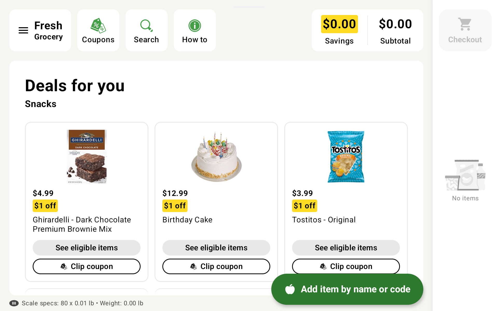

#### With Items in Cart

The mini cart displays items with badges showing quantity (for multiple items) or weight (for
produce items).

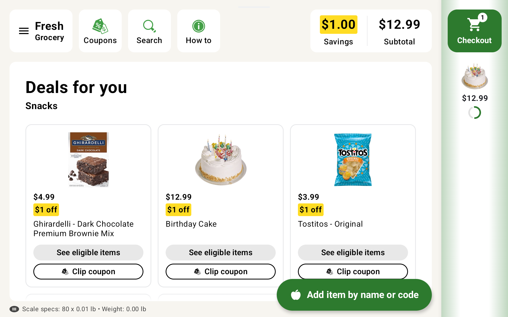

#### Quantity Badge

When multiple items of the same type are added, a badge shows the quantity (e.g., "x2").

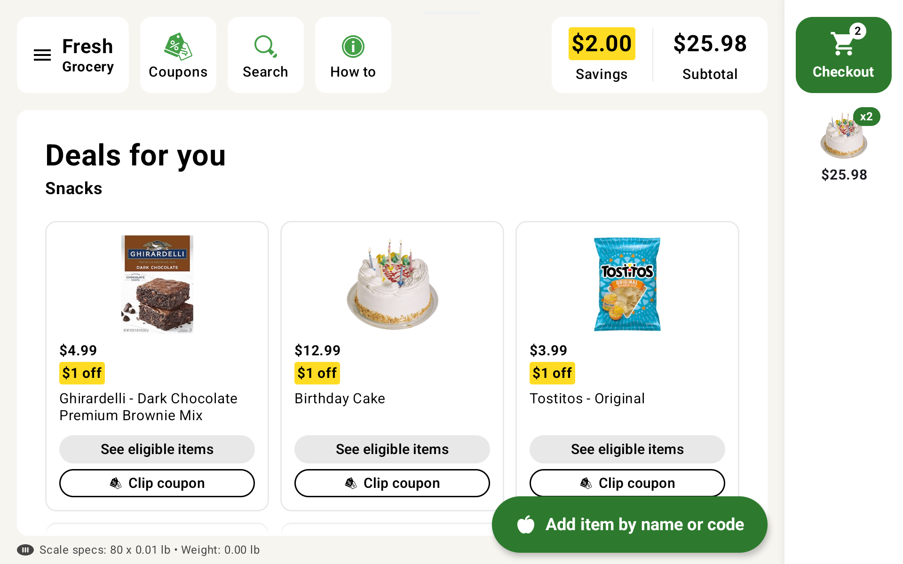

#### Weight Badge

For produce items, the badge displays the weight in pounds (e.g., "2.41 lb").

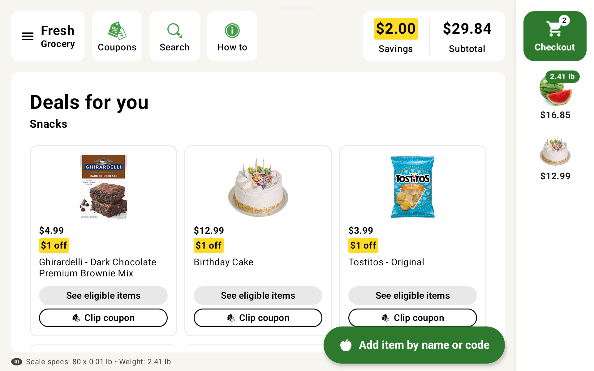

#### Expanded Cart View

Tap the mini cart or checkout button to view the full cart with all items and details.

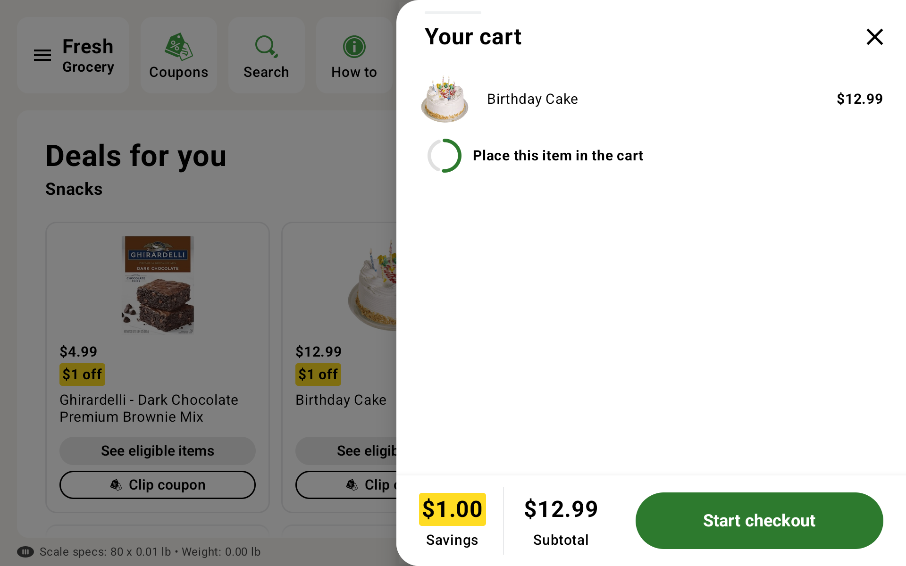

#### Keyboard Shortcuts

Use keyboard shortcuts for quick testing and item addition (see **[Available Keystrokes](#available-keystrokes)** section).

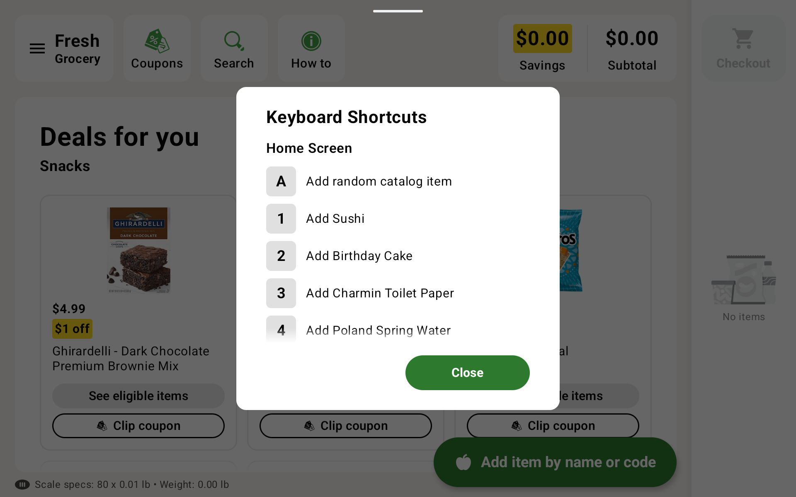

---

### Instructions Section

An overlay tutorial screen that explains how to add non-barcode items to the cart.

**Features:**

- **Auto-Playing Steps**: 4-step tutorial with automatic progression
- **Play/Pause Control**: Start, stop, or restart the tutorial
- **Progress Indicators**: Visual progress bars for each step
- **Step Illustrations**: Large images demonstrating each step
- **Step List**: Text descriptions of each step

**Tutorial Steps:**

1. Tap "Add item"
2. Select your item
3. Place in cart to weigh
4. Tap "Confirm" to add to cart

**Interactions:**

- Play/pause the tutorial using the button in top left
- Tutorial automatically advances through steps
- Close tutorial using X button in top right
- Restart tutorial by pressing play when at the end

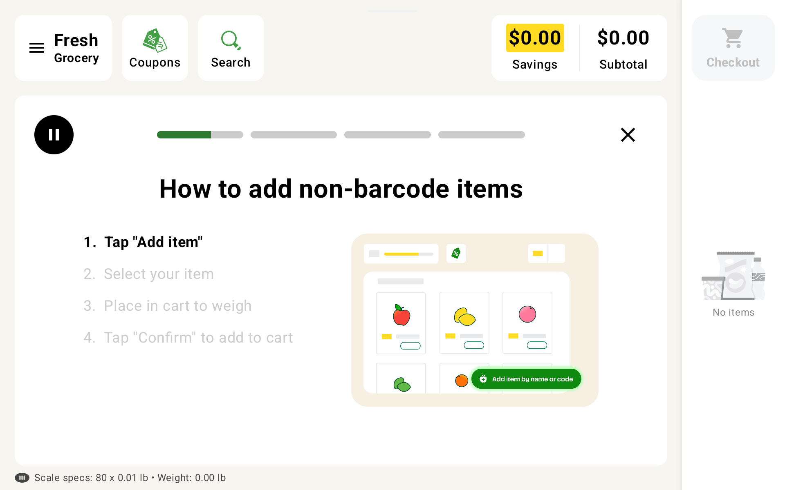

---

### Produce Search Screen

A dedicated screen for searching and selecting fresh produce items that require weighing.

**Features:**

- **Search Field**: Search items by name or product code
- **Back Button**: Return to home screen
- **Grid View**: Visual grid of all available produce items
- **Item Cards**: Each produce item displays an image and name
- **Weigh Mode Toggle**: Switch between "cart" and "scale" weigh instructions
- **Bottom Sheet**: Modal for confirming item weight and price before adding to cart

**Interactions:**

- Search for produce items using the search bar
- Tap on any produce item to open the weighing dialog
- Simulate placing item in cart/on scale to get weight
- Confirm weight and price to add item to cart
- Clear search using the X button in search field
- Toggle between cart and scale modes using the icon in top right

#### Produce Catalog (Cart Mode)

The produce search screen displays all available produce items in a grid layout. The cart icon in
the top right indicates "cart mode".

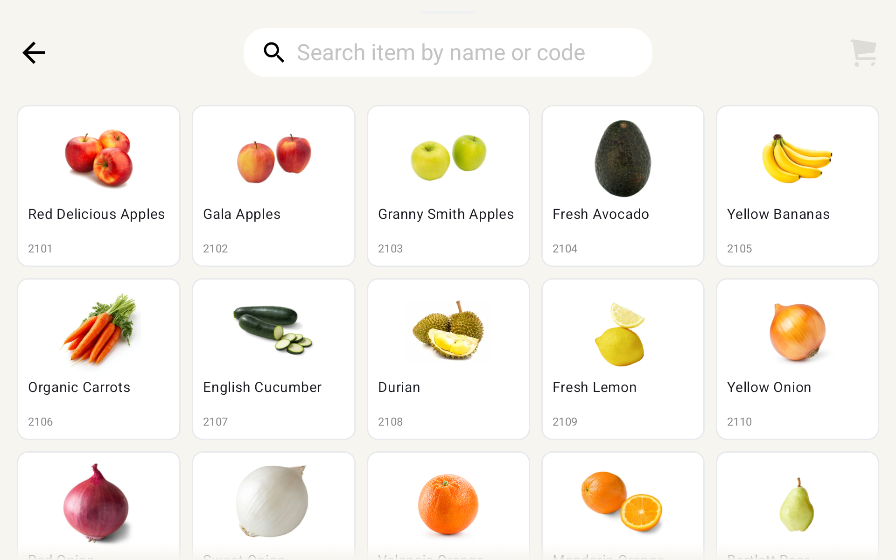

#### Produce Catalog (Scale Mode)

Toggle to "scale mode" using the icon in the top right to change the weighing instruction text.


#### Weighing Dialog (Before Weight)

When you select a produce item, a bottom sheet appears prompting you to place the item to weigh it.

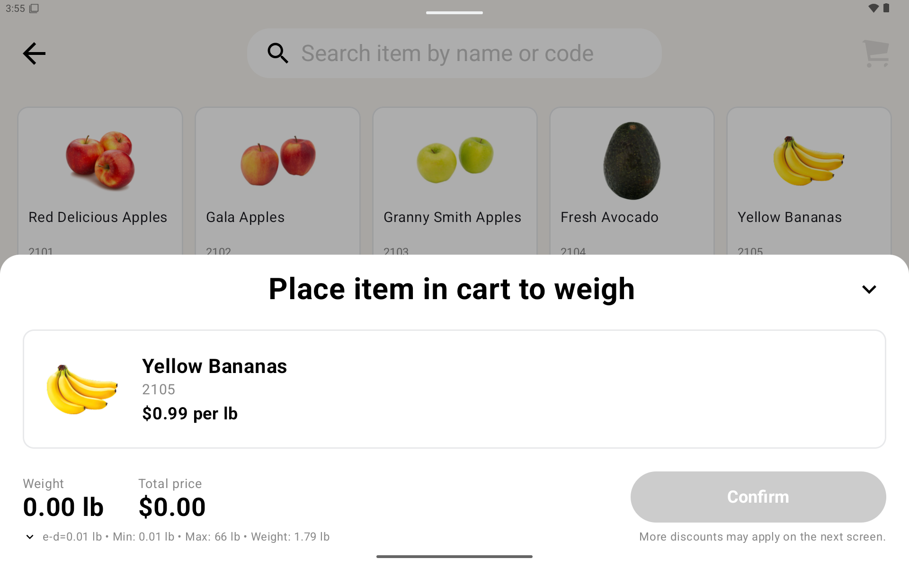

#### Weighing Dialog (After Weight)

After simulating the weight (press 'W' key), the weight and total price are displayed with an
enabled "Confirm" button.

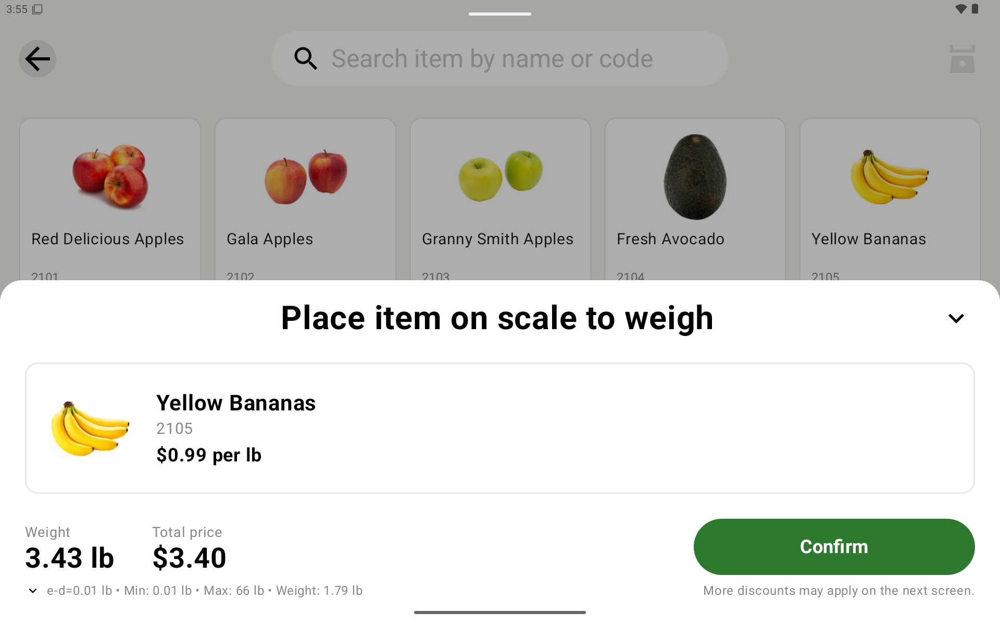

#### Weight Error Dialog

If there's an error during weighing (press 'E' key), the weight will fluctuate for 1.5 seconds
before an error dialog appears. The weight continues to fluctuate while the error is displayed,
prompting you to weigh again.

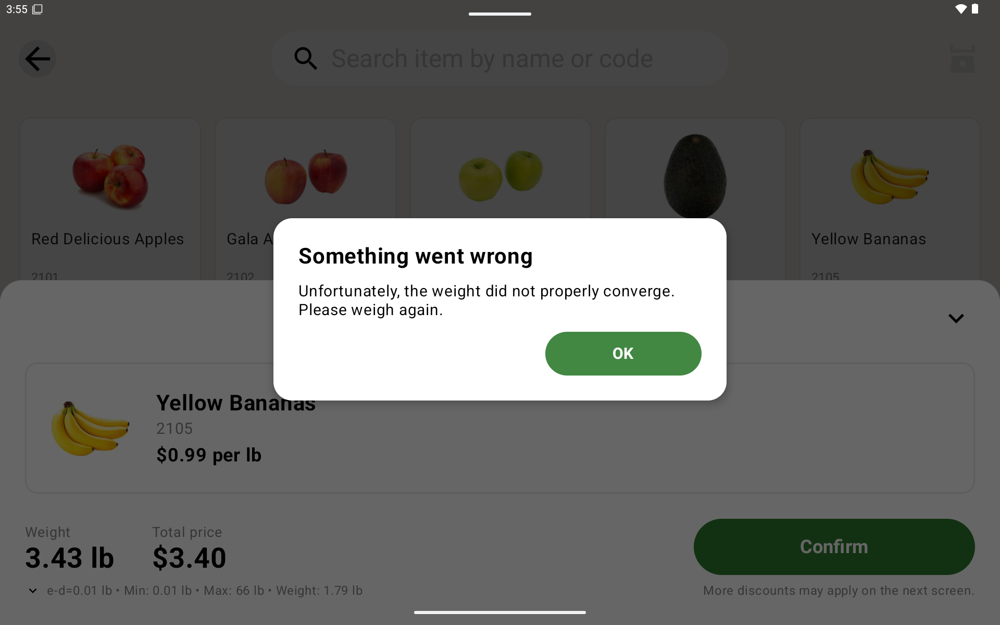

---

## Catalog Items

The catalog section contains 15 pre-packaged grocery items:

| Item | Price | Weight/Size | Barcode |
|------|-------|-------------|---------|
| Ghirardelli Dark Chocolate Premium Brownie Mix | $4.99 | 20 oz | 0000000041121 |
| Birthday Cake | $12.99 | 32 oz | 0000000041122 |
| Tostitos Original | $3.99 | 12 oz | 0000000041123 |
| Purina ONE Dry Dog Food - Lamb & Rice | $29.99 | 15 lb | 0000000041124 |
| Eggo Waffles | $4.99 | 12.3 oz | 0000000041125 |
| Catalina Crunch Cereal - Cinnamon Toast | $5.49 | 24 oz | 0000000041126 |
| Häagen-Dazs Ice Cream - Chocolate | $4.99 | 14 oz | 0000000041127 |
| Whole Milk | $4.29 | 1 gal | 0000000041128 |
| Banza Gluten-Free Chickpea Penne Pasta | $6.49 | 8 oz | 0000000041129 |
| Jif Extra Crunchy Peanut Butter | $5.99 | 16 oz | 0000000041130 |
| Fresh Sushi Roll | $9.99 | 8 oz | 0000000041131 |
| Charmin Ultra Soft Toilet Paper | $14.99 | 12 rolls | 0000000041132 |
| Hunt's Tomato Sauce | $2.99 | 24 oz | 0000000041133 |
| Poland Spring Water | $7.99 | 24 pack | 0000000041134 |
| Bounty Paper Towels - Select-A-Size | $19.99 | 8 rolls | 0000000041135 |

---

## Produce Items

The produce section contains 20 fresh items that require weighing:

| Item                 | Base Price | Approx. Weight | Barcode       |
|----------------------|------------|----------------|---------------|
| Red Delicious Apples | $2.99      | 1.5 lb         | 0000000042101 |
| Gala Apples          | $3.49      | 2 lb           | 0000000042102 |
| Granny Smith Apples  | $3.29      | 1.8 lb         | 0000000042103 |
| Fresh Avocado        | $1.99      | 0.4 lb         | 0000000042104 |
| Yellow Bananas       | $0.99      | 1 lb           | 0000000042105 |
| Organic Carrots      | $2.49      | 2 lb           | 0000000042106 |
| English Cucumber     | $1.49      | 0.8 lb         | 0000000042107 |
| Durian               | $12.99     | 3 lb           | 0000000042108 |
| Fresh Lemon          | $0.79      | 0.3 lb         | 0000000042109 |
| Yellow Onion         | $1.29      | 0.5 lb         | 0000000042110 |
| Red Onion            | $1.49      | 0.6 lb         | 0000000042111 |
| Sweet Onion          | $1.79      | 0.7 lb         | 0000000042112 |
| Valencia Orange      | $1.99      | 0.6 lb         | 0000000042113 |
| Mandarin Orange      | $2.49      | 0.5 lb         | 0000000042114 |
| Bartlett Pear        | $2.29      | 0.7 lb         | 0000000042115 |
| Russet Potato        | $0.89      | 0.8 lb         | 0000000042116 |
| Butternut Squash     | $2.99      | 1.2 lb         | 0000000042117 |
| Sweet Potato         | $1.99      | 1 lb           | 0000000042118 |
| Watermelon           | $6.99      | 8 lb           | 0000000042119 |
| Mac and Cheese       | $5.99      | 1.5 lb         | 0000000042120 |

---

## Available Keystrokes

The following keyboard shortcuts are available for quick testing and interaction:

### Home Screen

These shortcuts work on the Home Screen for quick item addition:

| Key   | Action                  | Item Added                               |
|-------|-------------------------|------------------------------------------|
| **A** | Add random catalog item | Random item from catalog                 |
| **1** | Add specific item       | Fresh Sushi Roll ($9.99)                 |
| **2** | Add specific item       | Birthday Cake ($12.99)                   |
| **3** | Add specific item       | Charmin Ultra Soft Toilet Paper ($14.99) |
| **4** | Add specific item       | Poland Spring Water ($7.99)              |
| **5** | Add specific item       | Purina ONE Dry Dog Food ($29.99)         |

**Note:** Keyboard shortcuts are only active when the Instructions section is closed.

### Produce Item Bottom Sheet

These shortcuts work when the produce weighing dialog is open:

| Key   | Action            | Description                                                                                                           |
|-------|-------------------|-----------------------------------------------------------------------------------------------------------------------|
| **W** | Simulate weighing | Randomizes weight between 1.0 and 10.0 lbs                                                                            |
| **E** | Trigger error     | Generates random weight that fluctuates for 1.5s, then shows error dialog. Weight continues fluctuating during error. |

**Note:** These shortcuts simulate the weighing process without needing actual scale hardware.

## Technology Stack

- **Language**: Kotlin
- **UI Framework**: Jetpack Compose
- **Architecture**: MVVM with ViewModel
- **Navigation**: Jetpack Navigation Compose
- **Build System**: Gradle with Kotlin DSL
